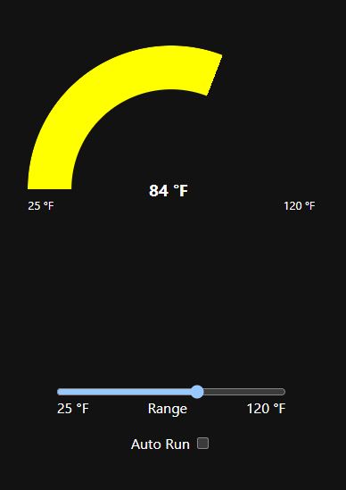

# **This is a Work in Progress!**

# CSS/JS Gauge

This is a simple gauge implemented with CSS and JavaScript. It was inspired by this article - [Circular gradient stroke chart](https://nerdy.dev/gradient-outline-circular-chart)

These these gists were also used here - 
* [fpillet/scale.js](https://gist.github.com/fpillet/993002)
* [av01d/ColorSteps.js](https://gist.github.com/av01d/538b3fffc78fdc273894d173a83c563f1)

## Overview

This gauge represents temperature in a range from 25 degrees to 120 degrees.

    <figure>
        
         
        <figcaption><strong>Gauge Screenshot</strong></figcaption>
    </figure>

### Details

Although this demo shows the gauge in °F the gauge can be configured for anything.

It also *shifts* color as the value transitions through configurable *ranges*.

The gauge is separate from the slider control and does not rely on it.

### Features

* Configurable:
  * Gauge Ranges - there can be one to N ranges, there is no limit except for what is within reason.
    * Range "top" limit - the "top" of the range is the maximum value for that range
    * Range Color - this is the color used while the value is in range
  * Gauge Color Shift - when enabled the entire gauge color will gradually shift from one range to the next range's color as the value changes. The starting point of the shift is also configurable.
  * Gauge Thickness - the thickness of the gauge "arc".
  * Gauge dial range and orientation - 
  * Gauge units - 
  * Scaling - 

